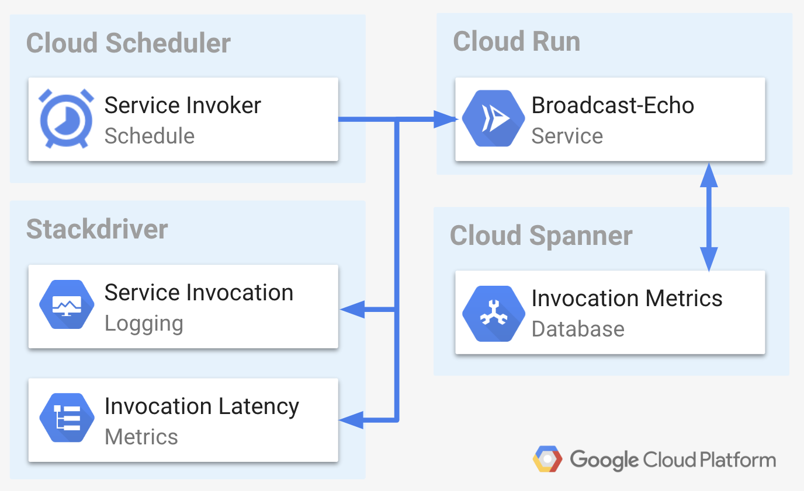

# distributed-echo

Simple Broadcast/Echo service for Cloud Run designed to demonstrate authenticated inter-service connectivity and measure latency between the different regions where this service is deployed.



> The inter-region service invocation latency measurements do not account for the implicit "cold starts" of each service. You can minimize it though by creating more frequent Cloud Scheduler invocations

## Pre-requirements

If you don't have one already, start by creating new project and configuring your [Google Cloud SDK](https://cloud.google.com/sdk/docs/). Also, if you have not done so already, you will have [set up Cloud Run](https://cloud.google.com/run/docs/setup).

### Config

All the variables used in this service are defined in the [bin/config](bin/config) file. You can edit these to your preferred values.

* `SERVICE_NAME` (default: `distributed-echo`) is the name of the service deployed into Cloud Run. Combination of this name is also used for database, schedule, and user name.
* `SERVICE_IMAGE_VERSION` (default: `0.5.6`) is the version of the image that will be build to use in Cloud Run deployment
* `SERVICE_REGIONS` (default: `us-central1`, `us-east1`, `europe-west1`, `asia-northeast1`) is all the regions where this service should be deployed to Cloud Run
* `DB_REGION` (default: `regional-us-central1`) is the Spanner instance configuration value which will dictate the deployment regions (alt: `nam3`, `nam-eur-asia1`)
* `DB_NODES` (default: `3`) is the number of Spanner nodes in created in the above defied region (see: https://cloud.google.com/spanner/docs/instances)


## Deployment

> Note, to keep this readme short, I will be asking you to execute scripts rather than listing here complete commands. You should review each one of these scripts for content. This will also help you understand the individual commands so you can use them in the future.

First, start by creating IAM user and granting that user all the necessary roles.

```shell
bin/setup
```

Next, setup the Spanner instance and a DB

```shell
bin/db
```

With IAM account created and Spanner DB configured, the only thing that we are missing is the container image. You can build that image using the [bin/image](bin/image) script:

```shell
bin/image
```

With the image built, you can now deploy the Cloud Run service to all the regions defined in the [bin/config](bin/config) using using [bin/deploy](bin/deploy) script:

```shell
bin/deploy
```

Finally, use the [bin/schedule](bin/schedule) script to crate one Cloud Schedule "cron" per each service

```shell
bin/schedule
```

## Metrics

You can monitor the metrics created by this service in one of two ways:

### SQL Query Spanner Database

The schema of the Spanner DB holding the metrics from this service is defined in the [bin/db](bin/db):

```sql
CREATE TABLE pings (
    id STRING(MAX) NOT NULL,
    target STRING(MAX) NOT NULL,
    source STRING(MAX) NOT NULL,
    sent TIMESTAMP NOT NULL,
    completed TIMESTAMP NOT NULL,
    duration INT64 NOT NULL
) PRIMARY KEY (id)
```

You can query it using SQL


### Stackdriver Time Series

This service also records each "echo" ping in Stackdriver as a custom time series metric (`custom.googleapis.com/metric/echo-latency`)


You can group that series by the `source` and `target` labels to get a detail chart of the latency in between regions


## Cleanup

To cleanup all resources created by this sample execute

```shell
bin/cleanup
```

## Disclaimer

This is my personal project and it does not represent my employer. I take no responsibility for issues caused by this code. I do my best to ensure that everything works, but if something goes wrong, my apologies is all you will get.


